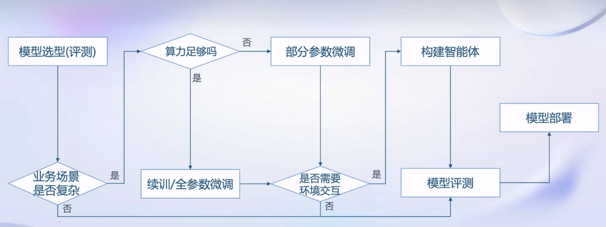
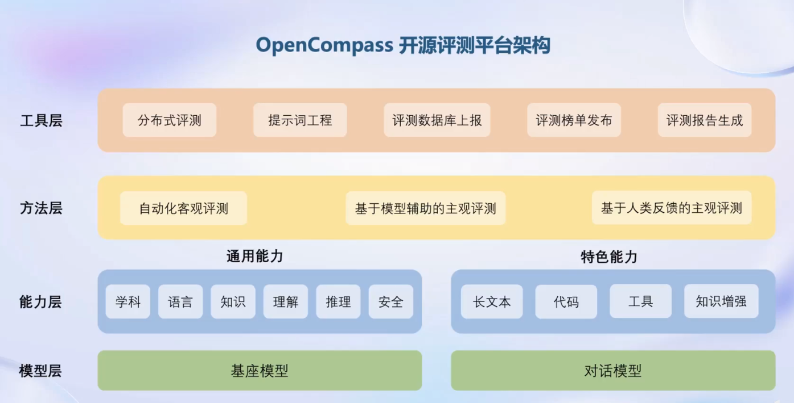

## 第一讲学习笔记
2024/1/3

专用到通用的转变：针对于特定任务，一个模型解决一个问题
通用：一个模型应对多种任务，多种模态

在2023年6月InternLM发布，完成覆盖轻量级、中量级、重量级的系列
一般个人用的是7b的轻量级便于部署

### 从模型到应用？存在一些需要完成的工作

### 数据来源
书生万卷，我可以从里面找到我感兴趣的方向相关的数据

### 微调框架XTuner，多种生态和算法
增量续训：让base学到一些新知识，如某个垂直领域知识，数据格式和预训练一致的
有监督微调：让模型学会**理解和遵循各种指令**，或者注入少量领域知识，需要一些高质量的对话、问答数据
SFT包括全量和部分参数微调
在这里我在之前一直有点搞混了，以为在微调阶段只有有监督微调

### 评测工具
客观、主观评测
提出了一些题目来进行评测
CLUE中文的评测体系
OpenCompass评测体系：学科、语言、知识、理解、推理、安全的六个维度进行评测

### 应用
多智能体、多种工具调用
可以调用python计算数列，调用多模态工具进行图片理解