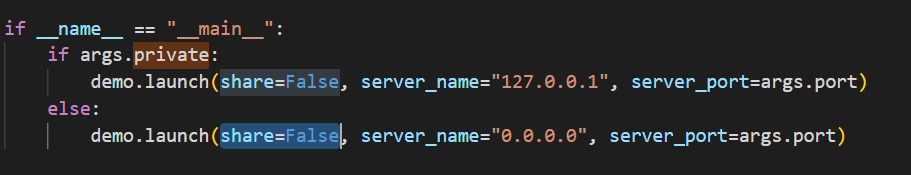
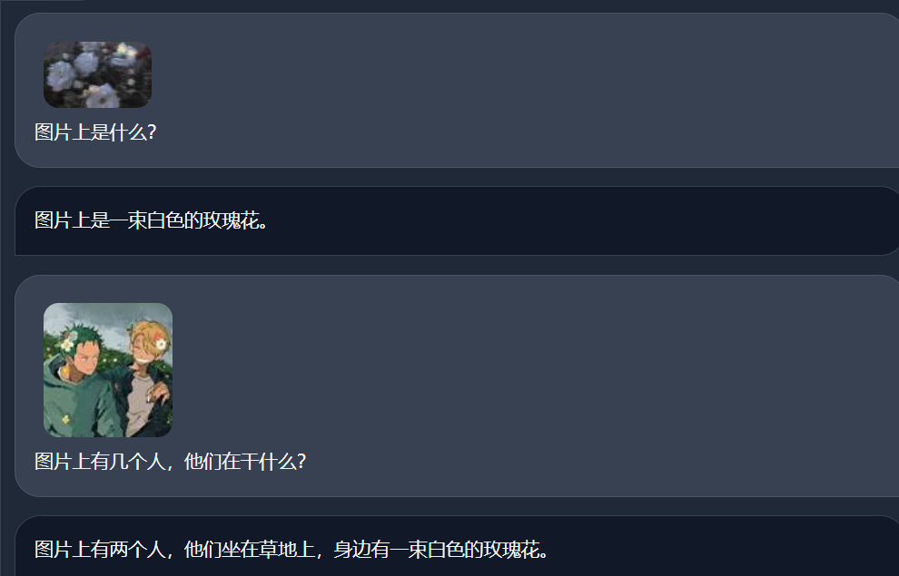
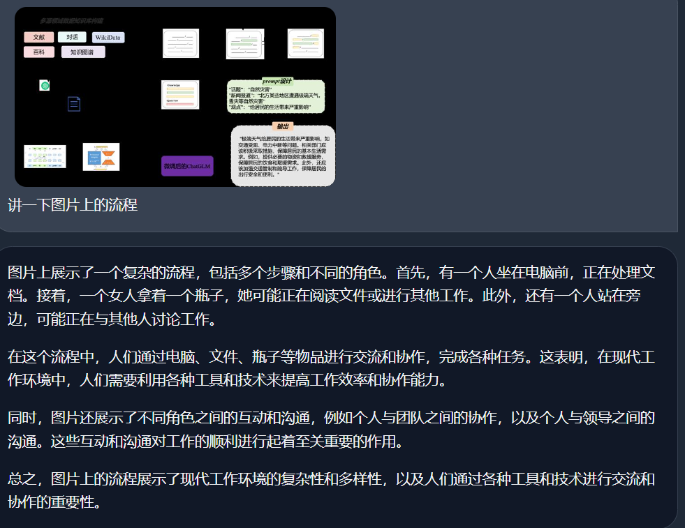

## 第二讲学习笔记
2024/1/5~2024/1/6

大模型的架构主要是Transformer、BERT、GPT等深度神经网络架构，在未经过大量特定领域数据训练的情况下有了加好的表现   
存在的问题包括：计算资源、训练成本的问题，大规模数据没那么多了，模型的可解释性问题   
两个开源的预训练模型：InternLM-7b和20b   
*Lagent 是一个轻量级、开源的基于大语言模型的智能体（agent）框架，支持用户快速地将一个大语言模型转变为多种类型的智能体，并提供了一些典型工具为大语言模型赋能。*

#### InternLM-Chat-7b的demo实现
使用A100的1/4   
需要输入bash进入conda环境！
创建一个环境internlm-demo名字，然后是已经在share文件夹下面配置好了的
等待一会。。。

git checkout 3028f07cb79e5b1d7342f4ad8d11efad3fd13d17
这个目的是切换提交的版本

然后写一个调用模型的python就可以体验对话能力了。

web端的使用 大概用了几分钟时间打开

#### Lagent 智能体工具调用Demo
做映射的方法：三个步骤
首先，在终端输入
streamlit run /root/code/lagent/examples/react_web_demo.py --server.address 127.0.0.1 --server.port 6006
然后本地输入33872是服务器的端口
ssh -CNg -L 6006:127.0.0.1:6006 root@ssh.intern-ai.org.cn -p 33872
浏览器输入
http://127.0.0.1:6006
就可以了

#### 浦语灵笔

在这里出现了错误，我把web.demo.py里的改了一下就可以了

可以进行图文并茂文章和多模态对话
经过尝试，在文章生成方面，模型表现得很不错
多模态对话方面，模型对于图片的信息会受到历史的影响

此外，在回答一些流程图的复杂图像问题时，模型不能够看出流程图的信息
