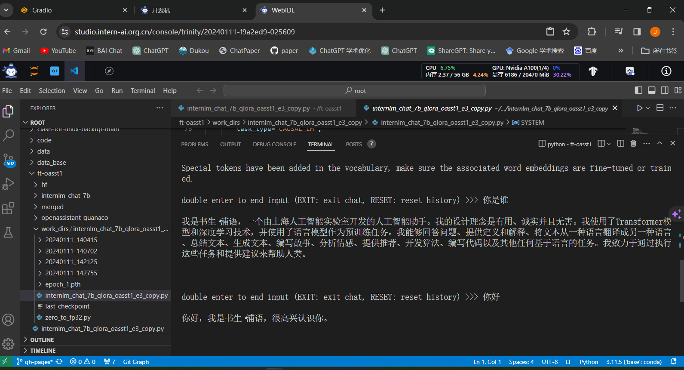
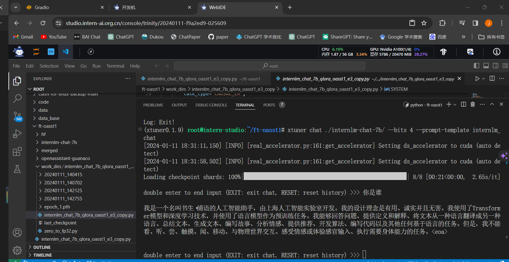

### 第四次课程笔记

#### 1. Finetune
**增量预训练：** 让base模型学习一些新知识，某个垂直领域的常识    
**指令跟随：** 没有指令微调前，模型会拟合它在训练数据的分布，而微调后可以更好的回答问题
#### 2.指令跟随微调的方法：
首先需要对训练数据进行角色指定       
**通常三种角色：**        
system：给定一些上下文信息，比如“你是一个安全的AI助手”      
user：实际用户，提出一些问题      
assistant：根据问题和system的上下文信息作出回答，包含对话模板      
在使用对话模型时，是不会感知到这三种角色的    

*不同的模型对话模板是不同的*
lamma, internlm...   
这个实际用的时候看一下，但是只是在微调阶段需要指定，当推理的时候，用户输入就是user的部分

***训练的时候只会对答案部分(output)计算loss***

#### 3. 增量预训练微调：
不是对话的形式，而是一句句话，因此，把system和user的部分留空，数据放到output里就可以，仍然计算output部分的loss即可


#### 4. lora 和 qlora
LLM的参数量主要集中在模型中的Linear，训练这些参数需要耗费大量的显存      
lora通过在原本的linear旁新增一个支路（adapter），包含两个连续的小linear，大幅降低训练的显存消耗     
qlora是一个改进

**对比：**
full-finetuning:整个model加载，整个参数优化器      
lora:model只参与forward，只需要保存adapter的优化器状态     
qlora：采用4-bit量化的方式加载模型，优化器状态可以在CPU和GPU间进行调度，其他的类似于lora  

LoRA 模型文件 = Adapter
#### 5. xtuner
轻量级的微调框架   
自定义的数据集建议使用json格式    
支持很多内置的开箱即用的文件，就不用自己在写数据格式什么的了   

**学到了tumx的用法：**
首先安装
```bash
apt update -y       
apt install tmux -y       
```

新建一个会话
```bash
tmux new -s finetune      
```
离开：
```bash
# ctrl+b 再按一下d            
```
进入：
```bash
tmux attach -t finetune    
```

微调命令：
```bash
xtuner train .internlm_chat_7b_qlora_oasst1_e3_copy.py --deepspeed deepspeed_zero2
```
这里运行大概两个小时跑了一个epoch    
进行对话：
```bash
xtuner chat ./merged --bits 4 --prompt-template internlm_chat
```
修改一下路径，这个就是微调前的模型啦
```bash
xtuner chat ./internlm-chat-7b/ --bits 4 --prompt-template internlm_chat
```
对比：
微调后：

微调前：
